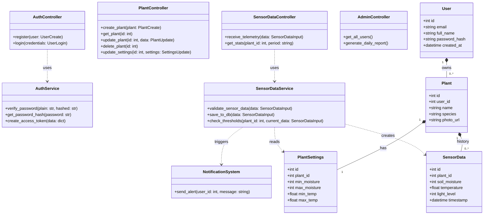

# Інструкція зі створення діаграм для Smart Plant Care (Lab 2)

Вам потрібно створити 3 діаграми у Draw.io, аналогічні до тих, що у Грега, але для вашої теми (Рослини).

## 1. UML Діаграма прецедентів (Use Case) - Як Рисунок 1
**Актори:**
- **User (Користувач)** - зліва.
- **IoT Device (Сенсор/ESP32)** - справа (або теж зліва, як зручно).

**Овали (Use Cases) посередині:**
1. **Реєстрація/Вхід** (User)
2. **Перегляд списку рослин** (User)
3. **Додавання нової рослини** (User) -> *include* -> **Налаштування меж поливу**
4. **Перегляд графіків (вологість/температура)** (User)
5. **Отримання Push-сповіщення** (User)
6. **Відправка даних телеметрії** (IoT Device) -> *стрілка до системи*
7. **Автоматична перевірка показників** (System/Timer)

*Стрілки:* Від User до oval'ів. Від IoT Device до "Відправка даних".

## 2. Діаграма класів (Class Diagram) - Як Рисунок 2
Цей варіант ідеально підходить. Ви можете намалювати його вручну блоками або вставити цей код у Draw.io (Arrange -> Insert -> Advanced -> Mermaid).

## 3. ER-діаграма (Схема БД) - Як Рисунок 3
Відображає таблиці та зв'язки (Crow's Foot notation - "лапка ворони").

**Сутності (Таблиці):**
1. **users**
   - PK: `id` (int)
   - `email` (varchar)
   - `password_hash` (varchar)
   
2. **plants**
   - PK: `id` (int)
   - FK: `user_id` (int) -> лінія до users
   - `name`, `species`

3. **plant_settings**
   - PK: `id` (int)
   - FK: `plant_id` (int) -> лінія до plants
   - `min_moisture`, `max_moisture`

4. **sensor_data**
   - PK: `id` (int)
   - FK: `plant_id` (int) -> лінія до plants
   - `soil_moisture`, `temperature`, `timestamp`

*Зв'язки:*
- users `||--o{` plants (Один до багатьох)
- plants `||--||` plant_settings (Один до одного)
- plants `||--o{` sensor_data (Один до багатьох)
