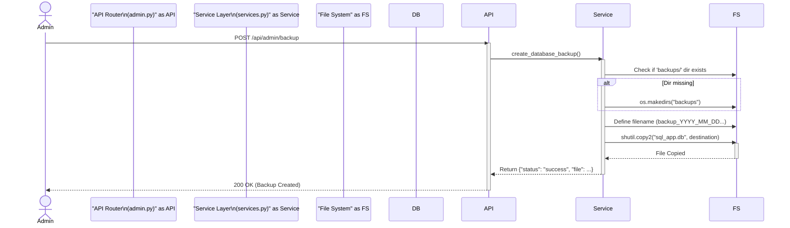

# Mermaid Code for Lab 3 Diagrams

Copy and paste the code blocks below into a Mermaid Live Editor (e.g., https://mermaid.live/) to generate the images for your report.

## 1. Activity Diagram (Business Logic: Health Index Calculation)
This diagram shows the algorithm used in `services.calculate_plant_health_index`.

```mermaid
activityDiagram
    start
    :User/Client requests Analytics;
    :Server calls calculate_plant_health_index(plant_id, days);
    
    partition "Business Logic Layer" {
        :Fetch PlantSettings (min/max thresholds);
        if (Settings found?) then (No)
            :Return Error "Settings missing";
            stop
        endif
        
        :Calculate start_date (Now - days);
        :Fetch SensorData from DB (timestamp >= start_date);
        
        if (Readings exist?) then (No)
            :Return Heath Index = 0;
            stop
        endif
        
        :Initialize total_points = count(Readings);
        :Initialize good_points = 0;
        
        while (Has more readings?)
            :Get next reading (moisture, temp);
            
            if (Moisture in valid range?) then (Yes)
                :is_moisture_good = True;
            else (No)
                :is_moisture_good = False;
            endif
            
            if (Temp in valid range?) then (Yes)
                :is_temp_good = True;
            else (No)
                :is_temp_good = False;
            endif
            
            if (is_moisture_good AND is_temp_good) then (Yes)
                :good_points += 1;
            elseif (is_moisture_good OR is_temp_good) then (Yes)
                :good_points += 0.5;
            else (No)
                :good_points unchanged;
            endif
        endwhile
        
        :Calculate Score = (good_points / total_points) * 100;
        
        if (Score >= 90) then (Yes)
            :Status = "Perfect";
        elseif (Score >= 75) then (Yes)
            :Status = "Good";
        elseif (Score >= 50) then (Yes)
            :Status = "Needs Attention";
        else (No)
            :Status = "Critical";
        endif
    }
    
    :Return Result JSON;
    stop
```

## 2. Sequence Diagram (Admin Function: Backup)
This diagram shows the interaction for the Administrative Backup feature.


