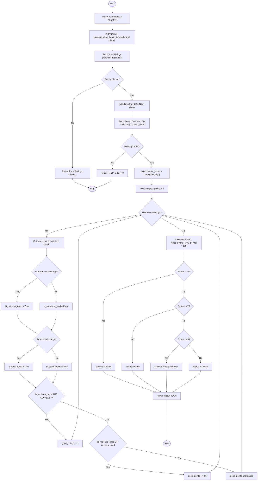
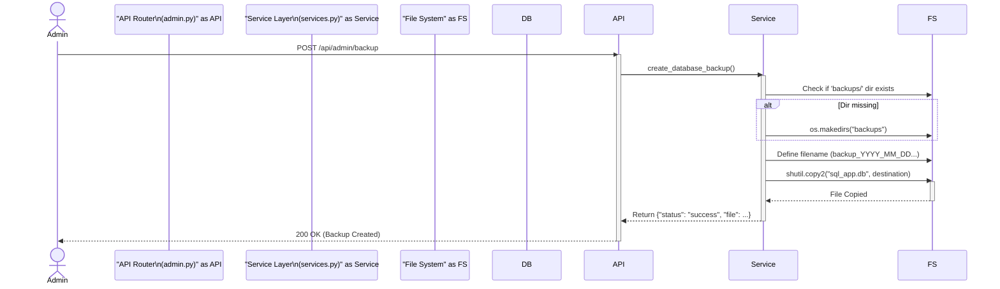

# Mermaid Code for Lab 3 Diagrams

Copy and paste the code blocks below into a Mermaid Live Editor (e.g., https://mermaid.live/) to generate the images for your report.

## 1. Activity Diagram (Business Logic: Health Index Calculation)
This diagram shows the algorithm used in `services.calculate_plant_health_index`.

## 2. Sequence Diagram (Admin Function: Backup)
This diagram shows the interaction for the Administrative Backup feature.

